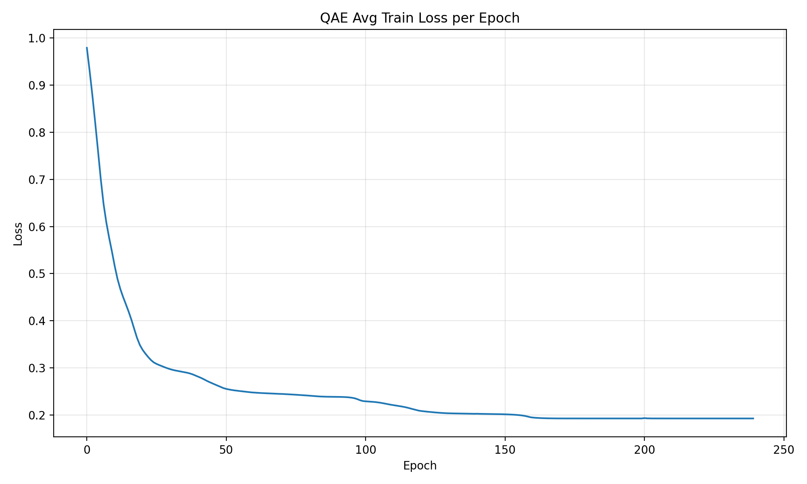
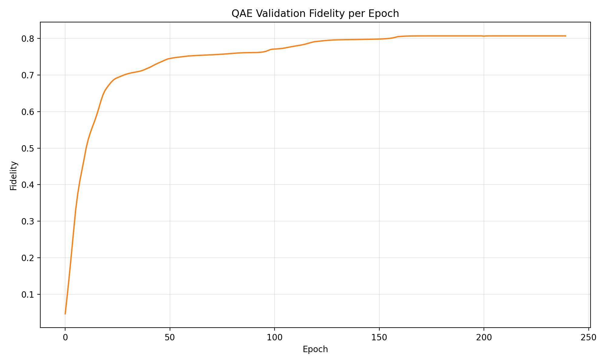
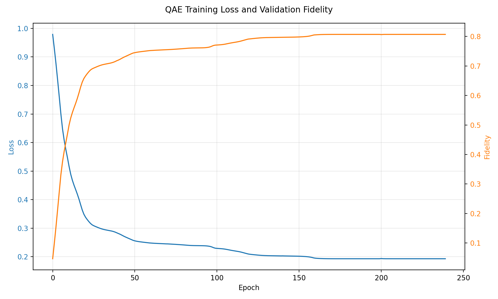
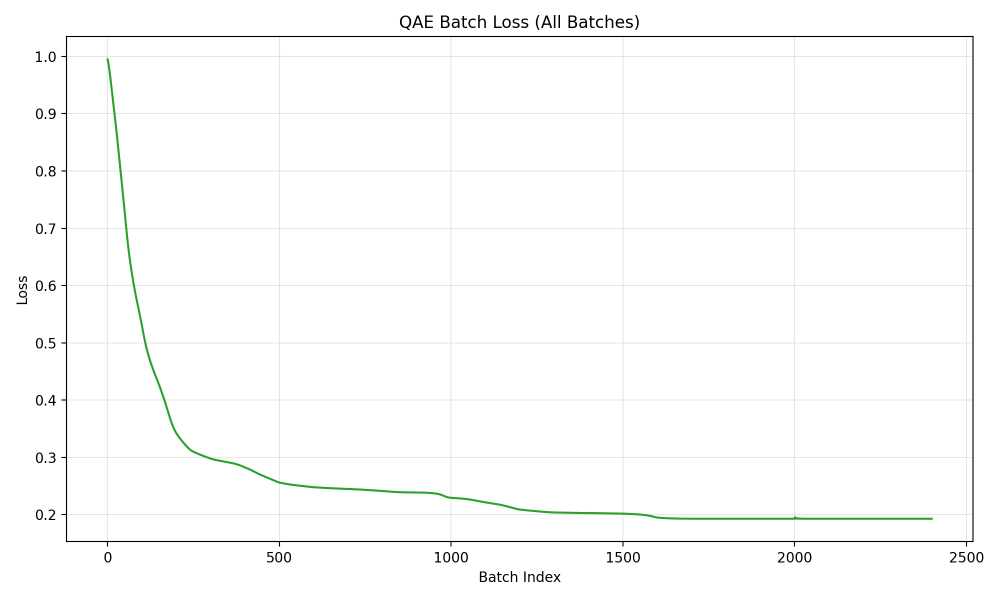

# 量子自编码器（QAE）训练报告

## 1. 概述
本报告总结了 QAE 模型的训练过程、主要指标变化及最终表现。

## 2. 训练与验证过程
- 训练集样本数：56000
- 验证集样本数：12000
- 测试集样本数：12000
- 实际每轮训练样本：1000
- 总训练 epoch 数：240

## 3. 主要指标统计
| 指标 | 最小值 | 最大值 | 最终值 | 最优 epoch |
|------|--------|--------|--------|------------|
| 平均训练损失 | {avg_loss_min:.4f} | {avg_loss_max:.4f} | {avg_loss_final:.4f} | - |
| 验证保真度   | {val_fidelity_min:.4f} | {val_fidelity_max:.4f} | {val_fidelity_final:.4f} | {best_val_epoch} |

## 4. 损失与保真度曲线

## 5. Batch Loss 曲线

## 6. 详细数据
- 训练与验证每轮指标：qae_epoch_metrics.csv
- 每个 batch 损失：qae_batch_losses.csv
- 统计摘要：qae_summary.csv

---
报告自动生成于 {date}
